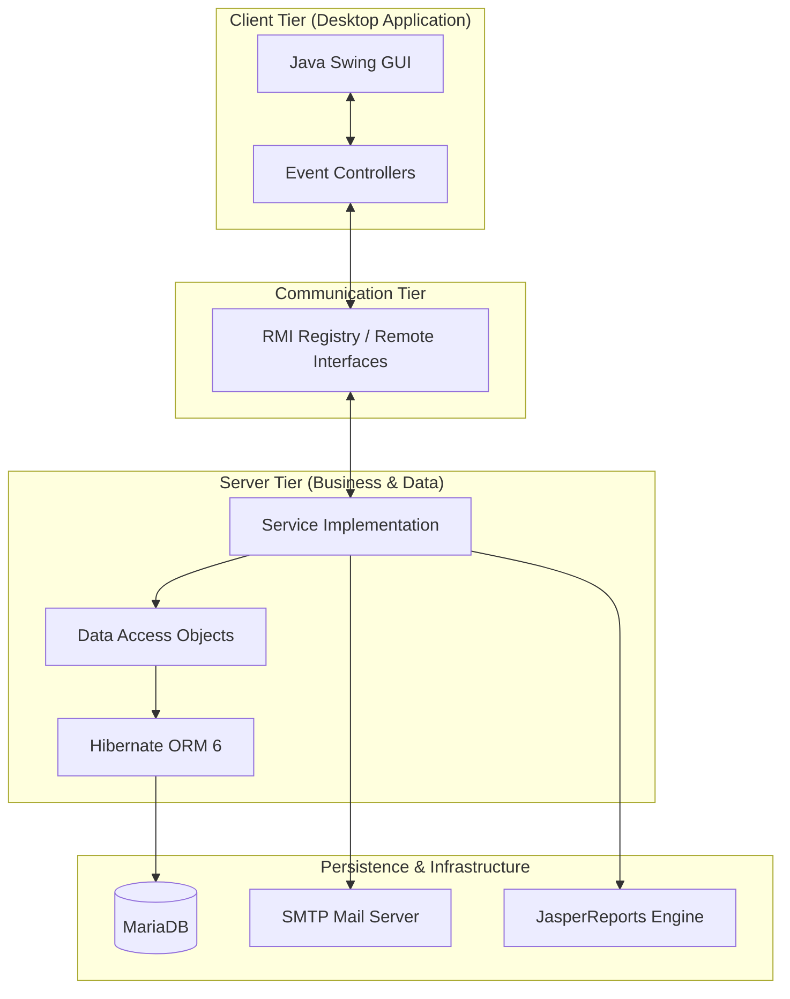

# 🍽️ ATun Kitchen - Hệ Thống Quản Lý Gọi Món Nhà Hàng Toàn Diện

## 📖 Giới thiệu

**ATun Kitchen** là một giải pháp phần mềm quản lý nhà hàng chuyên nghiệp, được xây dựng trên nền tảng Java Công nghệ cao. Hệ thống giải quyết triệt để các bài toán vận hành từ quản lý đặt bàn, điều phối món ăn đến thanh toán và chăm sóc khách hàng. 

Điểm nổi bật của dự án là kiến trúc **Client-Server** sử dụng **RMI**, cho phép xử lý dữ liệu tập trung, bảo mật cao và khả năng đáp ứng thời gian thực cho nhiều người dùng cùng lúc.

---

## 🏗️ Kiến trúc & Luồng dữ liệu

Dự án áp dụng mô hình kiến trúc phân tầng chuẩn (Layered Architecture):

---

## ✨ Hệ thống tính năng chi tiết

Hệ thống được thiết kế với sự tỉ mỉ trong từng luồng nghiệp vụ:

### 🛡️ Hệ thống & Bảo mật
- **Xác thực đa tầng**: Phân quyền truy cập dựa trên vai trò (Quản lý, Lễ tân, Thu ngân).
- **Bảo mật mật khẩu**: Sử dụng thuật toán mã hóa **SHA-256** để bảo vệ thông tin người dùng.
- **Quản lý mật khẩu thông minh**: Tính năng "Quên mật khẩu" tích hợp gửi mã xác nhận qua **Email (SMTP)**.
- **Màn hình Splash**: Hiệu ứng khởi động ứng dụng chuyên nghiệp.

### 📊 Dashboard & Quản lý Phân quyền
- **Giao diện tùy biến**: Mỗi vai trò nhân viên có DashBoard riêng với các chức năng phù hợp.
- **Quản lý Nhân viên**: Hồ sơ chi tiết, phân quyền vị trí (LNV1, LNV2, LNV3).

### 🏠 Quản lý Đặt bàn & Gọi món
- **Sơ đồ bàn trực quan**: Trạng thái bàn (Trống, Đã đặt, Đang dùng) cập nhật thời gian thực.
- **Tự động hóa trạng thái**: Tác vụ chạy ngầm (Background tasks) tự động cập nhật trạng thái bàn dựa trên giờ hẹn của khách.
- **Đặt bàn nâng cao**: Quản lý tiền cọc, hủy đơn và tính toán số tiền hoàn lại thông minh.
- **Chi tiết đặt bàn**: Quản lý danh sách món ăn kèm theo từng đơn đặt.

### 🧾 Quản lý Thanh toán & Khách hàng
- **Hóa đơn chuyên nghiệp**: Tạo và in hóa đơn (Invoice) nhanh chóng.
- **Khuyến mãi và Ưu đãi**: Áp dụng mã giảm giá, tự động tính toán giá sau giảm.
- **Chăm sóc Khách hàng**: Quản lý lịch sử giao dịch và phân loại khách hàng thân thiết.
- **Tích hợp Email**: Tự động gửi email chúc mừng/ưu đãi cho khách hàng nhân dịp đặc biệt.

### � Thống kê & Báo cáo (Analytics)
- **Doanh thu trực quan**: Biểu đồ thống kê doanh thu theo thời gian.
- **Phân tích món ăn**: Thống kê các món ăn bán chạy nhất để tối ưu menu.
- **Xuất dữ liệu đa dạng**: Xuất báo cáo chi tiết ra file **PDF (JasperReports)** hoặc **Excel**.

---

## 🛠️ Công nghệ & Thư viện sử dụng

Hệ thống tích hợp các công nghệ hiện đại nhất trong hệ sinh thái Java:

| Thành phần | Công nghệ / Thư viện |
| :--- | :--- |
| **Ngôn ngữ** | Java 17 |
| **Giao diện (UI)** | Swing, FlatLaf (Material Design), MigLayout, TimingFramework |
| **Lịch & Thời gian** | JCalendar, LGoodDatePicker |
| **Persistence** | Hibernate 6.0, JPA, MariaDB |
| **Communication** | Java RMI (Remote Method Invocation) |
| **Reporting** | JasperReports 6.21 |
| **Bảo mật** | Java MessageDigest (SHA-256), Javax Mail (jakarta.mail) |
| **Tiện ích** | Lombok, Apache POI (Excel), Net Datafaker, Commons BeanUtils |
| **Build Tool** | Apache Maven |

---

## 📁 Cấu trúc thư mục mã nguồn

- `dao/`: Lớp truy xuất dữ liệu (Data Access Objects).
- `gui/`: Toàn bộ giao diện người dùng, forms và các component tùy chỉnh.
- `main/`: Điểm khởi chạy (Main classes) và Dashboards.
- `model/`: Các thực thể (Entities) định nghĩa cấu trúc dữ liệu.
- `rmi/`: Cấu hình Server-side RMI.
- `service/`: Lớp xử lý nghiệp vụ chính (Business Logic).
- `util/`: Các hàm tiện ích dùng chung (Format, Helpers, Security).

---

## 👥 Nhóm thực hiện
Dự án được phát triển bởi nhóm **ATun Kitchen**.

---

© 2026 ATun Kitchen Project. All rights reserved.
